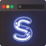

# Sessionic

A web extension to easily save sessions and manage them.

**Popup View**

**Full View**

---

## Features

- Ability to save and manage sessions
- Ability to import and export sessions for backup
- Built with performance in mind
- Optimized for lower memory usage
- Doesn't consume RAM or CPU when idle
- Modern UI
- Light and Dark mode
- Cross-browser support. (Firefox, Chrome, Edge, and Opera)

## Download

## Build locally

1. Clone the repository `git clone https://github.com/navorite/sessionic.git`
2. Run `pnpm install`
3. Run `pnpm run build` for Chromium `pnpm run build-ff` for Firefox

## Running in browser

1. Build the extension locally
2. Run `pnpm run add` for Chromium or `pnpm run add:ff` for Firefox
