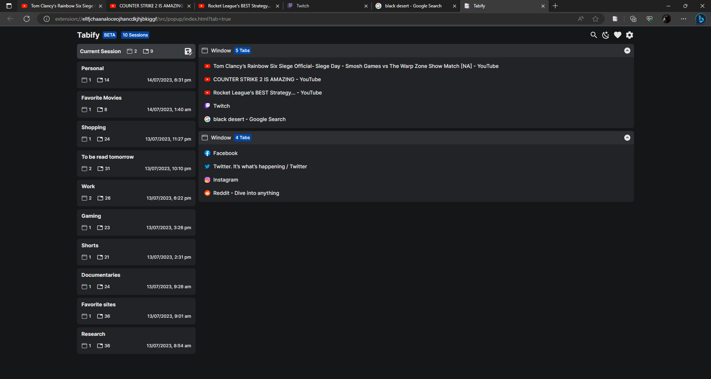
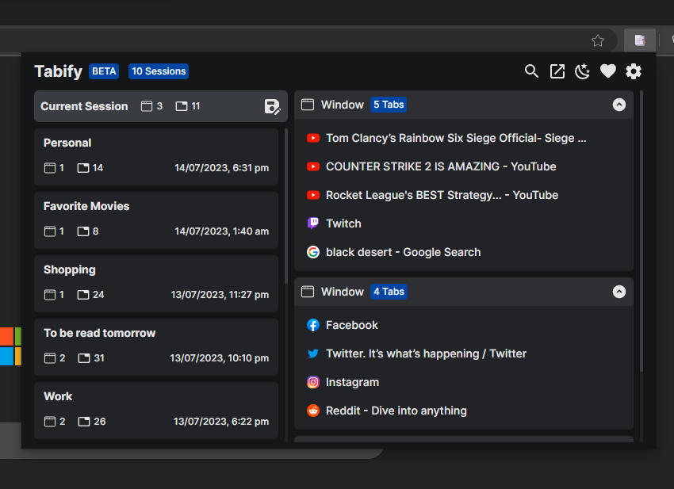

# Tabify

A web extension to easily save sessions and manage them.

**Full View**

**Popup View**

---

## Features

- Ability to save and manage sessions
- Ability to export and import sessions for backup
- Built with performance in mind
- Low memory usage
- Doesn't consume RAM or CPU when not in use
- Cross-browser support. (Firefox, Chrome, Edge, and Opera)

## Build locally

1. Clone the repository `git clone https://github.com/navorite/tabify.git`
2. Run `pnpm install`
3. Configure the extension manifest.json in `./src/public/` folder
4. Run `pnpm run build`

## Adding to browser

### For Firefox

1. Go to Extensions
2. Click the Settings icon
3. Click Debug Add-ons
4. Go to This Firefox
5. Click on Load Temporary Add-on...
6. Open the `./dist/folder`

### For Chromium

1. Go to Extensions
2. Enable Developer mode
3. Click on Load unpacked
4. Open the `./dist/` folder

## License

[AGPL](./LICENSE) © navorite
