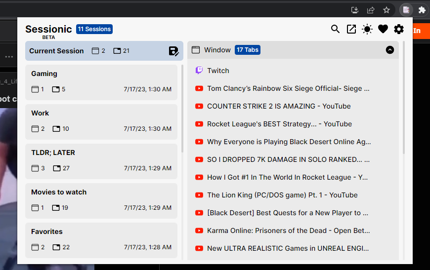
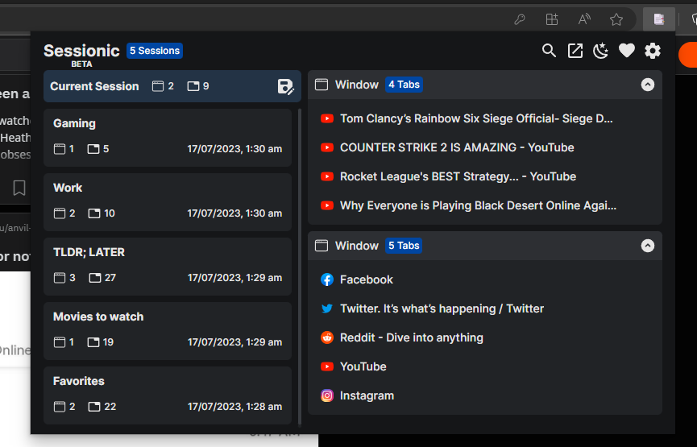
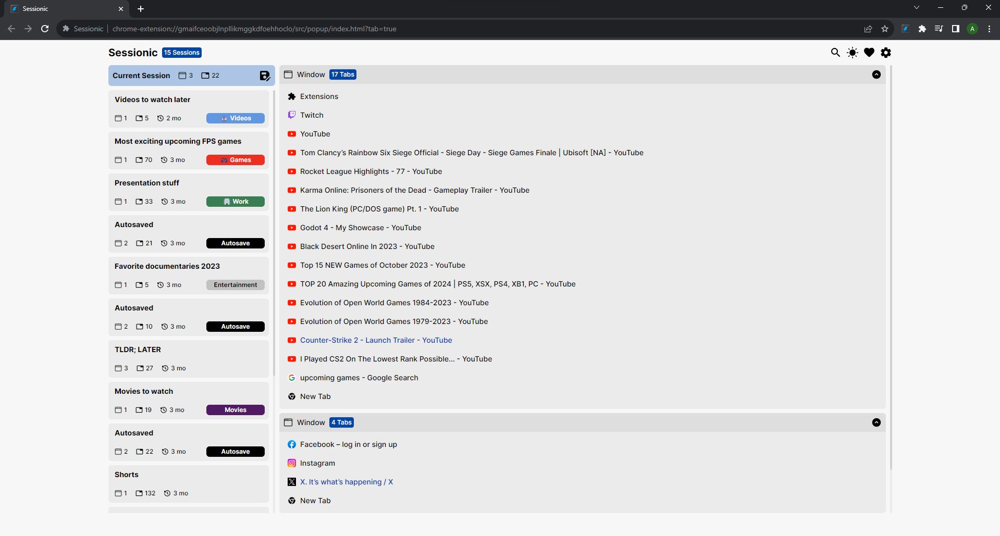
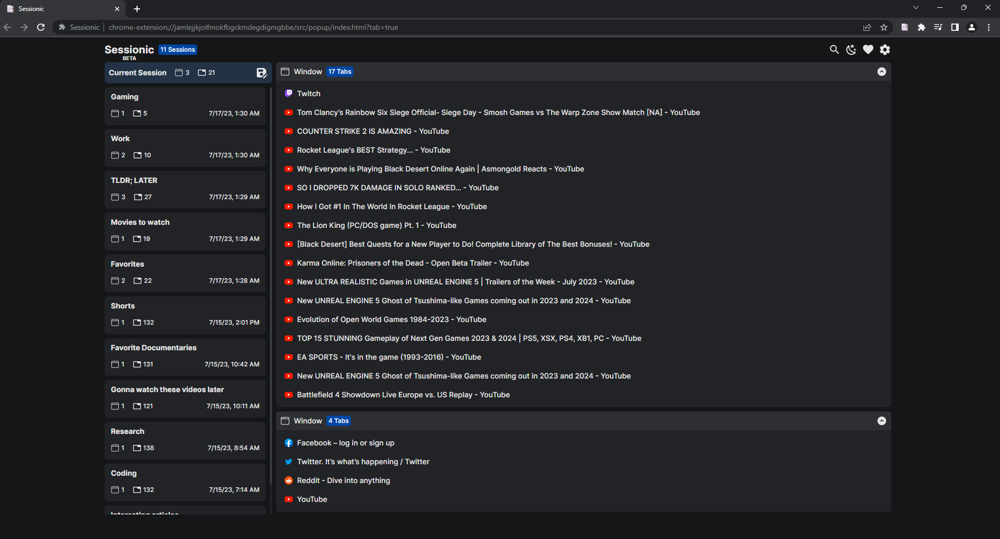

# Sessionic

A web extension to save, manage and restore sessions and tabs.

[![Chrome Extension version](https://img.shields.io/chrome-web-store/v/mdakbhkahkmdafnfhdikbddkngcbhenc?logo=data%3Aimage%2Fsvg%2Bxml%3Bbase64%2CPHN2ZyB4bWxucz0iaHR0cDovL3d3dy53My5vcmcvMjAwMC9zdmciIHdpZHRoPSIxZW0iIGhlaWdodD0iMWVtIiB2aWV3Qm94PSIwIDAgMjU2IDI1NiI%2BPHBhdGggZmlsbD0iI0ZGRiIgZD0iTTEyOC4wMDMgMTk5LjIxNmMzOS4zMzUgMCA3MS4yMjEtMzEuODg4IDcxLjIyMS03MS4yMjNjMC0zOS4zMzUtMzEuODg2LTcxLjIyMy03MS4yMjEtNzEuMjIzYy0zOS4zMzUgMC03MS4yMjIgMzEuODg4LTcxLjIyMiA3MS4yMjNjMCAzOS4zMzUgMzEuODg3IDcxLjIyMyA3MS4yMjIgNzEuMjIzWiIvPjxwYXRoIGZpbGw9IiMyMjkzNDIiIGQ9Ik0zNS44OSA5Mi45OTdjLTUuMzEzLTkuMjAzLTExLjU1OC0xOC44NjItMTguNzM2LTI4Ljk3N2ExMjcuOTggMTI3Ljk4IDAgMCAwIDExMC44NTcgMTkxLjk4MWMxMS43OC0xNi41MjMgMTkuNzgtMjguNDM3IDIzLjk5Ni0zNS43NGM4LjA5OS0xNC4wMjggMTguNTczLTM0LjExMiAzMS40MjMtNjAuMjUxdi0uMDE1YTYzLjk5MyA2My45OTMgMCAwIDEtMTEwLjg1Ny4wMTdjLTE3LjQ1My0zMi41NDgtMjkuNjgtNTQuODg3LTM2LjY4My02Ny4wMTVaIi8%2BPHBhdGggZmlsbD0iI0ZCQzExNiIgZD0iTTEyOC4wMDggMjU1Ljk5NkExMjcuOTcyIDEyNy45NzIgMCAwIDAgMjU2IDEyNy45OTdBMTI3Ljk4MyAxMjcuOTgzIDAgMCAwIDIzOC44MzcgNjRjLTI0LjI0OC0yLjM5LTQyLjE0My0zLjU4NS01My42ODYtMy41ODVjLTEzLjA4OCAwLTMyLjEzOSAxLjE5NS01Ny4xNTIgMy41ODVsLS4wMTQuMDFhNjMuOTkzIDYzLjk5MyAwIDAgMSA1NS40NDQgMzEuOTg3YTYzLjk5MyA2My45OTMgMCAwIDEtLjAwMSA2NC4wMWwtNTUuNDIgOTUuOTg5WiIvPjxwYXRoIGZpbGw9IiMxQTczRTgiIGQ9Ik0xMjguMDAzIDE3OC42NzdjMjcuOTg0IDAgNTAuNjY5LTIyLjY4NSA1MC42NjktNTAuNjdjMC0yNy45ODYtMjIuNjg1LTUwLjY3LTUwLjY3LTUwLjY3Yy0yNy45ODMgMC01MC42NjkgMjIuNjg2LTUwLjY2OSA1MC42N3MyMi42ODYgNTAuNjcgNTAuNjcgNTAuNjdaIi8%2BPHBhdGggZmlsbD0iI0UzM0IyRSIgZD0iTTEyOC4wMDMgNjQuMDA0SDIzOC44NGExMjcuOTczIDEyNy45NzMgMCAwIDAtMjIxLjY4NS4wMTVsNTUuNDE5IDk1Ljk5bC4wMTUuMDA4YTYzLjk5MyA2My45OTMgMCAwIDEgNTUuNDE1LTk2LjAxNGwtLjAwMi4wMDFaIi8%2BPC9zdmc%2B&label=Chrome)](https://chrome.google.com/webstore/detail/sessionic/mdakbhkahkmdafnfhdikbddkngcbhenc)

**Popup View**
| Light | Dark |
| :------------------------------------------------------: | :-------------------------------------------------------------: |
|  |  |

**Full View**
| Light | Dark |
| :------------------------------------------------------: | :-------------------------------------------------------------: |
|  |  |

---

## Features

- Save and manage sessions
- Import and export sessions
- Save sessions automatically based on an interval
- Filter URL list to track using [match patterns](https://developer.mozilla.org/en-US/docs/Mozilla/Add-ons/WebExtensions/Match_patterns)
- Modern UI with Light and Dark mode support
- Ability to add tags to sessions
- Focused on performance and lower RAM usage
- Cross-browser support (Firefox, Chrome, Edge, and Opera)
- Compatible with Session Buddy, OneTab and Tab Session Manager

## Download

## Roadmap

You can check the project's [Roadmap](https://github.com/users/navorite/projects/1) for a brief look into upcoming features.

## Localization

You can contribute to the localization of the extension at [Weblate](https://hosted.weblate.org/projects/sessionic/)!

<h3 align="center">Translation status</h3>

## Common Questions and Answers

You can read the extension's Common Questions and Answers [here](https://github.com/navorite/sessionic/discussions/69).

## Build locally

1. Clone the repository `git clone https://github.com/navorite/sessionic.git`
2. Run `pnpm install`
3. Run `pnpm run build` for Chromium `pnpm run build:ff` for Firefox

## Running in browser

1. Build the extension locally using `pnpm run build` for Chromium or `pnpm run build:ff` for Firefox
2. Run `pnpm run open` for Chromium or `pnpm run open:ff` for Firefox
